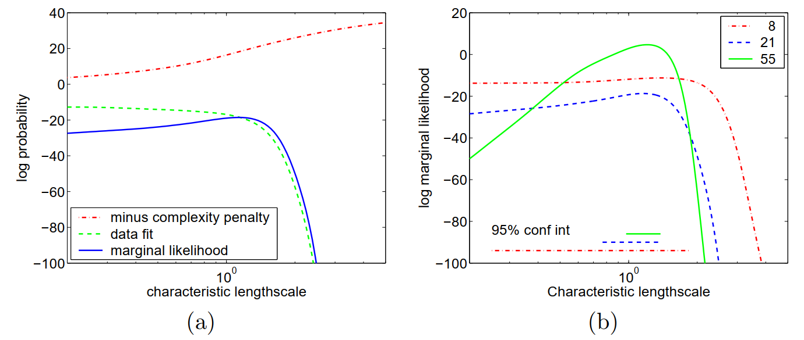

```{r setup, include=FALSE}
knitr::opts_chunk$set(echo = TRUE, 
                      comment = NA,
                      cache = TRUE)
knitr::opts_chunk$set(fig.height = 5, 
                      fig.width = 5.7, 
                      out.width = '100%',
                      fig.align='center')

## for kernel generating functions
library("kernlab")
library("geoR")

## tidy packages
library("tidymodels")
library("tidyverse")

## directory and data clean
library("here")
library("janitor")

## output and styles
library("knitr")
library("tinytex")
library("bookdown")


colorize <- function(x, color) {
  if (knitr::is_latex_output()) {
    sprintf("\\textcolor{%s}{%s}", color, x)
  } else if (knitr::is_html_output()) {
    sprintf("<span style='color: %s;'>%s</span>", color, x)
  } else x
}

```

# Model Selection and Adaptation of Hyperparameters

## 5.1 The Model Selection Problem

$$
k(\pmb x_p, \pmb x_q) = \sigma_f^2 \exp \big( − \frac 1 2 (\pmb x_p − \pmb x_q)^{\top}M(\pmb x_p − \pmb x_q)\big) + \sigma_n^2\sigma_{pq}\ \ \ \ \ (5.1)
$$

Here we define the notations like this through the slides:

- $\{_c\ a_i\}_{i=1}^I$ means to stack every units column-wise, which is a column vector;                
- $\{_r\ b_j\}_{j=1}^J$ means to stack every units row-wise, which is row vector;           
- $\{_d\ c_k\}_{k=1}^K$ means to stack every units in the diagonal-wise; which is a matrix.
- $\{_m\ d_{i,\ j} \}_{i = 1 \times j =1}^{I \times J}$ means to store every units in a matrix for given $i$ and $j$ position, which is a matrix.  


For example, for $\pmb a_i = (x_i,\ y_i,\ z_i)$ a row vector:

- $\pmb {\mathcal A} = \{_c\ \pmb a_i\}_{i=1}^{I}$ is a $I \times 3$ matrix;
- $\pmb {A} = \{_r\ \pmb a_i\}_{i=1}^{I}$ is a $1 \times 3I$ vector;
- $\pmb {\mathbb A} = \{_d\ \pmb a_i\}_{i=1}^{I}$ is a $I \times 3I$ vector.


The notations in Chapter 4 and 5 are a little bit confusing. Here we clarify: In **eq.5.1**, $\pmb x_p$ and $\pmb x_q$ are two "time" points. but each of them will be a vector, for example in a three dimensional space ($a,\ b,\ c$), then $\pmb x_p = (a_p,\ b_p,\ c_p)$.  

`r colorize("The real matrix or vector form:", "red")` $\pmb {\mathbb x} = \{_c\  \pmb x_i^{\top} \}_{i = 1}^{T} = \{_m\ x_{ij} \}_{(i=1) \times (j = 1)}^{T \times (D = 3)}$


To distinguish Chapter 4 from Chapter 5: the notation in Chapter 4 $\pmb x$ and $\pmb x'$ (in **eq.4.29** the neural network kernels) are also vectors at two "time" points. but each of them will be a vector of higher order, for example: $\pmb x = (1,\ x,\ x^2,\ x^3)$;    

`r colorize("The real matrix or vector form:", "red")`  $\pmb {\mathbb x} = \{_c\  \pmb x_i^{\top} \}_{i = 1}^{T} = \Big\{_c \{_r\ x_j = x^{j}\}_{j=0}^{P}\Big\}_{i=1}^T = \{_m\ x_{ij} \}_{(i=1) \times (j = 0)}^{T \times (P = 3)}$


```{r include=FALSE}
library(plgp)
eps <- sqrt(.Machine$double.eps)

```


```{r}
nx <- 50
x <- seq(-3, 3, length=nx)
X <- expand.grid(x, x)
X <- as.matrix(X)
# dim(X)
# View(X)

## I am using the hand-calculate the distance matrix X
## Can I just use the matrix algibra?
# D <- plgp::distance(X)
# ?distance
# dim(D)
# View(D)
# Dsq <- D^2
# View(D)
```

```{r}
get_symm <- function(M) {
   M[upper.tri(M)] <- t(M)[upper.tri(M)]
   return(M)
}
```

```{r "figure5.1(a)", fig.width=10}
set.seed(2019)
l1 <- 1
M1 <- l1^(-2) * diag(2)
Sigma1 <- matrix(NA, nrow = nrow(X), ncol = nrow(X))
for (i in seq_along(1:nrow(X))) {
  for (j in seq_along(1:nrow(X))) {
    ## I personally define X stored column-wise
    ## this is an earlier mistake
    diff <- (X[i, ] - X[j, ])
    Sigma1[i, j] <- exp(-0.5 * diff %*% M1 %*% diff)
  }
}
Sigma1 <- Sigma1 %>% get_symm()
Y1 <- mvtnorm::rmvnorm(1, sigma = Sigma1)

## just too big to be plotted
# GA::persp3D(1:nrow(Sigma1), 
#             1:nrow(Sigma1), 
#             Sigma1, 
#             theta = -45, 
#             phi = 30, 
#             expand = 1,
#             xlab = "grid",
#             ylab = "grid",
#             zlab = "Kernel Sigma1",
#             scale = FALSE,
#             border = "grey50",
#             # col.palette = heat.colors,
#             # shade = 1,
#             box = T,
#             axes = T)


GA::persp3D(x, x, -matrix(Y1, ncol=nx), 
            theta = -55, 
            phi = 30, 
            expand = 1.2,
            xlab = "input x1", 
            xlim = c(-3, 3),
            ylab = "input x2", 
            ylim = c(-3, 3),
            zlab = "output y",
            zlim = c(-2, 2.7),
            scale = FALSE,
            border = "grey10",
            # col.palette = heat.colors,
            # shade = 1,
            box = T,
            axes = T)
```


```{r "figure5.2(b)", fig.width=10}
set.seed(2021)
# l <- c(1, 3)
# Sigma <- exp(-0.5 * Dsq  / l[1]^2 - 0.5 * Dsq / l[2]^2)
l2 <- c(1, 3)
M2 <- l2^(-2) * diag(2)

# Sigma2 <- exp(-0.5 * X %*% M1 %*% t(X)) %>% get_symm()
Sigma2 <- matrix(NA, nrow = nrow(X), ncol = nrow(X))
for (i in seq_along(1:nrow(X))) {
  for (j in seq_along(1:nrow(X))) {
    ## I personally define X stored column-wise
    ## this is an earlier mistake
    diff <- (X[i, ] - X[j, ])
    Sigma2[i, j] <- exp(-0.5 * diff %*% M2 %*% diff)
  }
}

# dim(Sigma2)
Y2 <- mvtnorm::rmvnorm(1, sigma = Sigma2)
GA::persp3D(x, x, matrix(Y2, ncol=nx), 
            theta = -55, 
            phi = 30, 
            expand = 2,
            xlab = "input x1", 
            xlim = c(-3, 3),
            ylab = "input x2", 
            ylim = c(-3, 3),
            zlab = "output y",
            zlim = c(-1.2, 2),
            scale = FALSE,
            border = "grey20",
            # col.palette = terrain.colors,
            # shade = 1,
            box = T,
            axes = T)
```


```{r "figure5.2(c)", fig.width=10}
set.seed(2021)
l3 <- 1 / 6^2 * diag(2)
Lambda <- matrix(c(1, -1), ncol = 1)
M3 <- Lambda %*% t(Lambda) + l3 %>% as.matrix() 

Sigma3 <- matrix(NA, nrow = nrow(X), ncol = nrow(X))

for (i in seq_along(1:nrow(X))) {
  for (j in seq_along(1:nrow(X))) {
    ## I personally define X stored column-wise
    ## this is an earlier mistake
    ## Sigma3[i, j] <- exp(-0.5 * X[i, ] %*% M3 %*% X[j, ])
    diff <- (X[i, ] - X[j, ])
    Sigma3[i, j] <- exp(-0.5 * diff %*% M3 %*% diff)
  }
}

Y3 <- mvtnorm::rmvnorm(1, sigma = Sigma3)
# View(Sigma3)
# dim(Sigma)
# sum(diag(Sigma))
# View(Y3)
GA::persp3D(x, x, matrix(Y3, ncol=nx), 
            theta = -55, 
            phi = 30, 
            expand = 1.2,
            xlab = "input x1", 
            xlim = c(-3, 3),
            ylab = "input x2", 
            ylim = c(-3, 3),
            zlab = "output y",
            zlim = c(-2.5, 3),
            scale = TRUE,
            # col.palette = heat.colors,
            # shade = 0.11,
            # border = "grey35",
            # box = T,
            axes = T)
```


$\theta  = (\{M\},\ \sigma_f^2,\ \sigma_n^2)^{\top}$ is a vector containing all the hyperparameters, and $\{M\}$ denotes the parameters in the symmetric matrix $M$. 

$$
M_1 = \pmb {\mathcal l}^{−2}I, \ \ \ \ (5.2a)\\
M_2 = diag(\pmb {\mathcal l}  )^{−2}, \ \ \ \ (5.2b)\\
M_3 = \Lambda \Lambda ^{\top} + diag(\pmb {\mathcal l})^{−2}, \ \ \ \ (5.2c)
$$

where $\pmb {\mathcal l}$ is a vector of positive values, and $\Lambda$ is a $D \times k$ matrix, $k < D$. 


$M_2$ (automatic relevance determination): the inverse of the length-scale determines how relevant an input is - if the length-scale has a very large value, the covariance will become almost independent of that input, effectively removing it from the inference.

$M_3$ (factor analysis distance): seeks to explain the data
through a low rank plus diagonal decomposition. 


Although there are endless variations in the suggestions for model selection in the literature three general principles cover
most:           

(1) compute the probability of the model given the data

(2) estimate the generalization error 

(3) bound the generalization error. 

## 5.2 Bayesian Model Selection

### level 1

$\pmb w$ is a vector of the lowest level parameters, $\theta$ is a vector of the hyperparameters.

$$
p(\pmb w|\pmb y, X, \pmb \theta , \mathcal {H_i}) = \frac {p(\pmb y|X, \pmb w, \mathcal {H_i})p(\pmb w|\pmb \theta , \mathcal {H_i})}
{p(\pmb y|X, \pmb \theta , \mathcal {H_i})} \ \ \ \ (5.3)
$$

$p(\pmb y|X, \pmb w, \mathcal {H_i})$ is the likelihood; 
$p(\pmb w|\pmb \theta , \mathcal {H_i})$ is the parameter prior.

<!-- \alert {why ${p(\pmb y|X, \pmb w, \mathcal {H_i})p(\pmb w|\pmb \theta , \mathcal {H_i})}$ is the joint? $p(\pmb w, \pmb y|X, \pmb \theta, \mathcal {H_i})$} -->

$$
p(\pmb y|X, \pmb \theta , \mathcal {H_i}) = \int p(\pmb y|X, \pmb w, \mathcal {H_i})p(\pmb w|\pmb \theta , \mathcal {H_i}) d\pmb w\ \ \ \ (5.4)
$$

### level 2

$$
p(\pmb \theta |\pmb y, X, \mathcal {H_i}) = 
\frac {p(\pmb y|X, \pmb \theta , \mathcal {H_i})p(\pmb \theta |\mathcal {H_i})}
{p(\pmb y|X, \mathcal {H_i})} \ \ \ \  (5.5)
$$

where $p(\pmb \theta |\mathcal H_i)$ is the hyper-prior (the prior for the hyperparameters). 

$$
p(\pmb y|X, \mathcal {H_i}) = \int p(\pmb y|X, \pmb \theta , \mathcal {H_i})p(\pmb \theta |\mathcal {H_i})d\pmb \theta \ \ \ \  (5.6)
$$


$$
p(\mathcal {H_i}|\pmb y, X) = \frac {p(\pmb y|X, \mathcal {H_i})
p(\mathcal {H_i})}
{p(\pmb y|X)} \ \ \ \ (5.7)
$$

where $p(y|X) = \sum_i p(y|X, \mathcal {H_i})p(\mathcal {H_i})$, Depending on the details of the models, these integrals may or may not be analytically tractable and in general one may have to resort to analytical approximations or Markov chain Monte Carlo (MCMC) methods. 

In practice, especially the evaluation of the integral in **eq. (5.6)** may be difficult, and as an approximation one may
shy away from using the hyperparameter posterior in **eq. (5.5)**, and instead maximize the marginal likelihood in **eq. (5.4)** w.r.t. the hyperparameters, $\pmb \theta$.
This approximation is known as **type II maximum likelihood (ML-II)**. 

The prior over models $\mathcal H_i$ in **eq. (5.7)** is often taken to be flat, so that a priori we do not favour one model over another.

This effect is called **Occam’s razor** after William of Occam 1285-1349, whose principle: "lurality should not be assumed without necessity" he used to encourage simplicity in explanations. 

Notice that the trade-off between data-fit and model complexity is automatic; there is no need to set a parameter externally to fix the trade-off. Do not confuse the automatic Occam’s razor principle with the use of priors in the Bayesian method. Even if the priors are "flat" over complexity, the marginal likelihood will still tend to favour the least complex model able to explain the data. Thus,
a model complexity which is well suited to the data can be selected using the marginal likelihood.


## 5.3 Cross-validation

Typical values for $k$ are in the range 3 to 10.
An extreme case of $k$-fold cross-validation is obtained for $k = n$, the number of training cases, also known as **leave-one-out cross-validation (LOO-CV)**.


## 5.4 Model Selection for GP Regression

### 5.4.1 Marginal Likelihood 

$$
\log p(\pmb y|X, \pmb \theta ) = − \frac 1 2 \pmb y^{\top}K_y^{−1} \pmb y − \frac 1 2 \log |K_y| − \frac n 2 \log 2\pi \ \ \ \ (5.8)
$$

where $K_y = K_f + \sigma_n^2I$ is the covariance matrix for the noisy targets $\pmb y$ (and $K_f$ is the covariance matrix for the noise-free latent $\pmb f$), and we now explicitly write the marginal likelihood conditioned on the hyperparameters (the parameters of the covariance function) $\pmb \theta$. 

The only term involving the observed targets is the data-fit
$−\pmb y^{\top}K_y^{−1} \pmb y/2$; $\log |K_y|/2$ is the complexity penalty depending only on the covariance function and the inputs and $n\\log(2\pi)/2$ is a normalization constant.

```{r}

```


```{r out.width="60%"}
knitr::include_graphics('figure/5-4.png')
```

The complexity of computing the marginal likelihood in **eq. (5.8)** is dominated by the need to invert the $K$ matrix (the $\log$ determinant of $K$ is easily computed as a by-product of the inverse). 

$$
\frac \partial {\partial \theta_j} \log p(\pmb y|X, \pmb \theta) = \frac 1 2 \pmb y^{\top} K^{−1} \frac {\partial K} {\partial \theta_j} K^{−1}\pmb y − \frac 1 2  tr \Big(K^{−1} \frac {\partial K} {\partial \theta_j} \Big) = 
\frac 1 2 tr \Big((\pmb \alpha \pmb \alpha^{\top} − K^{−1})
\frac {\partial K} {\partial \theta_j}\ \ \ \ (5.9)
$$

where $\pmb \alpha = K^{−1} \pmb y$. using a gradient based optimizer is advantageous.


```{r}
knitr::include_graphics('figure/5-5.png')
```


### 5.4.2 Cross-validation

$$
\log p(y_i|X, \pmb y_{−i}, \pmb \theta) = − \frac 1 2
\log \sigma_i^2 − \frac {(y_i − \mu_i)^2}
{2\sigma^2_i} − \frac 1 2 \log 2\pi \ \ \ \  (5.10)
$$


$$
L_{LOO}(X, \pmb y, \pmb \theta ) = \sum_{i=1}^n
\log p(y_i|X, \pmb y_{−i}, \pmb \theta) \ \ \ \  (5.11)
$$

LOO-CV predictive mean and variance are

$$
\mu_i = y_i − \frac {[K^{−1} \pmb y]_i}
{[K^{−1}]_{ii}}\ \ \ \ (5.12a)\\
\sigma_i^2 = 1/[K^{−1}]_{ii} \ \ \ \ (5.12b)
$$

where careful inspection reveals that the mean $\mu_i$ is in fact independent of $y_i$ as indeed it should be.

$$
\frac {\partial \mu_i} {\partial \theta_j} =
\frac {[Z_j\pmb \alpha]_i} {[K^{−1}]_{ii}} −
\frac {\pmb \alpha_i[Z_j K^{−1}]_{ii}} {[K^{−1}]^2_{ii}}\ \ \ \ (5.13a)\\
\frac {\partial \sigma^2_i} {\partial \theta_j} =
\frac {[Z_j K^{−1}]_{ii}} {[K^{−1}]^2_{ii}} \ \ \ \ (5.13b)
$$

where $\alpha = K^{−1}y$ and $Z_j = K^{−1} \frac {\partial \theta} {\partial K_j}$ 


$$
\frac {\partial L_{LOO}} {\partial \theta_j} =
\sum_{i=1}^n 
{\frac {\partial  \log p(y_i|X, \pmb y_{−i}, \pmb \theta)} {\partial \mu_i}} 
{\frac {\partial \mu_i} {\partial \theta_j}} +
{\frac {\partial  \log p(y_i|X, \pmb y_{−i}, \pmb \theta)} {\partial \sigma^2_i} }
{\frac {\partial \sigma^2_i} {\partial \theta_j}} = \\ 
\sum^n_{i=1} \Bigg(\alpha_i[Z_j \pmb \alpha]_i − \frac 1 2 \Big(1 + {\frac {\alpha^2_i} {[K^{-1}]_{ii}}} \Big) 
[Z_j K^{−1}]_{ii} \Bigg) /[K−1]_{ii} \ \ \ \ \ (5.14)
$$

### 5.4.3 Examples and Discussion

#### Mauna Loa Atmospheric Carbon Dioxide

$$
k_1(x, x') = \theta_1^2 \exp \Bigg(− \frac {(x − x')^2} {2\theta^2_2} \Bigg) \ \ \ \ \ (5.15)
$$

$$
k_2(x, x') = \theta_3^2 \exp 
\Bigg( 
− {\frac {(x − x')^2} {2 \theta_4^2}} 
− {\frac {2 \sin^2 \big( \pi (x − x') \big)} {\theta^2_5}}
\Bigg) \ \ \ \ (5.16)
$$


$$
k_3(x, x') = \theta_6^2 
\Bigg(
1 + {\frac {(x − x')^2} {2 \theta_8 \theta_7^2}} 
\Bigg)^{\theta_8} \ \ \ \ \ (5.17)
$$

$$
k_4(x_p, x_q) = \theta_9^2 \exp 
\Bigg( 
− \frac {(x_p − x_q)^2} {2\theta^2_{10}}
\Bigg)
+ \theta_{11} \sigma_{pq} \ \ \ \ (5.18)
$$


$$
k(x, x') = k_1(x, x') + k_2(x, x') + k_3(x, x') + k_4(x, x')\ \ \ \ \ (5.19)
$$

with hyperparameters $\pmb \theta = (\theta_1,\ ...,\ \theta_{11})^{\top}$


## 5.5 Model Selection for GP Classification

### 5.5.1 Derivatives of the Marginal Likelihood for Laplace’s ∗
Approximation

$$
\log q(\pmb y|\pmb X, \pmb \theta ) = 
− {\frac 1 2} {\hat {\pmb f}}^{\top}K^{−1}{\hat {\pmb f}}  + \log p(\pmb y|{\hat {\pmb f}} ) − {\frac 1 2} \log |B|, (5.20)
$$

where $B = I + W^{\frac 1 2}  K W^{\frac 1 2}$ and  ${\hat {\pmb f}}$  is the maximum of the posterior **eq. (3.12)** found by Newton’s method in **Algorithm 3.1**, and $W$ is the diagonal matrix $W = −\nabla \nabla \log p(\pmb y| {\hat {\pmb f}})$. We can now optimize the approximate marginal likelihood $q(\pmb y|\pmb X, \pmb \theta)$ w.r.t. the hyperparameters, $\pmb \theta$. To this end we seek the partial derivatives of $\frac {\partial q(\pmb y|\pmb X, \pmb \theta)} {\partial \theta_j}$. The covariance matrix $\pmb K$ is a function of the hyperparameters, but  ${\hat {\pmb f}}$  and therefore $W$ are also implicitly functions of $\pmb \theta$, since
when $\pmb \theta$ changes, the optimum of the posterior ${\hat {\pmb f}}$ also changes. Thus

$$
\frac {\partial  \log q(\pmb y|\pmb X, \pmb \theta )} {\partial \theta_j} =
\frac {\partial  \log q(\pmb y| \pmb X, \pmb \theta)} {\partial \theta_j} \Bigg|_{explicit} +
\sum_{i=1}^n
\frac {\partial  \log q(\pmb y| \pmb X, \pmb \theta )} {\partial {\hat f_i}}
\frac {\partial {\hat f_i}} {\partial \theta_j} \ \ \ \ \ (5.21)
$$


$$
\frac {\partial  \log q(\pmb y| \pmb X, \pmb \theta)} {\partial \theta_j} \Bigg|_{explicit} =
{\frac 1 2} \hat {\pmb f}^{\top} K^{-1} 
\frac {\partial K} {\partial \theta_j} K^{-1} \hat {\pmb f}
- {\frac 1 2} tr\Bigg((W^{-1} + K)^{-1} \frac {\partial K} {\partial \theta_j}\Bigg) \ \ \ \ \ (5.22)
$$


$$
\frac {\partial  \log q(\pmb y| \pmb X, \pmb \theta)} {\partial {\hat f_i}} = 
− {\frac 1 2}
\frac {\partial  \log |B|} {\partial {\hat f_i}} = 
− {\frac 1 2}
tr \Bigg( B^{−1}K {\frac {\partial W} {\partial {\hat f_i}}} \Bigg) = \\
− {\frac 1 2} [(K^{−1} + W)^{−1}]_{ii} 
\frac {\partial^3} {\partial f_i^3} \log p(\pmb y| {\hat {\pmb f}} ) \ \ \ \ \ (5.23)
$$

$\hat {\pmb f} = K \nabla \log p(\pmb y|\hat {\pmb f})$

$$
\frac {\partial {\hat {\pmb f}}} {\partial \theta_j} =
\frac {\partial K} {\partial \theta_j} \nabla \log p(\pmb y| {\hat {\pmb f}}) + 
K \frac {\partial \nabla \log p(y| {\hat {\pmb f}} )}{\partial  {\hat {\pmb f}}}
\frac  {\partial {\hat {\pmb f}}} {\partial \theta_j} = 
(I + KW)^{−1} \frac {\partial K} {\partial \theta_j} \nabla \log p(\pmb y| {\hat {\pmb f}}) \ \ \ \ \ (5.24)
$$

where we have used the chain rule $\partial /\partial \theta_j = \partial  {\hat {\pmb f}} /\partial \theta_j \cdot \partial /\partial  {\hat {\pmb f}}$  and the identity $\partial \nabla \log p(\pmb y| {\hat {\pmb f}} )/\partial  {\hat {\pmb f}}  = −W$. The desired derivatives are obtained by plugging **eq. (5.22-5.24)** into **eq. (5.21)**


1. input: $X$ (inputs), $y$ ($\pm\ 1$ targets), $\pmb \theta$  (hypers), $p(\pmb y|\pmb f)$ (likelihood function)
2. compute $K$ compute covariance matrix from $X$ and $\pmb \theta$             
3. $(\pmb f, \pmb a) := mode(K,\ \pmb y,\ p(\pmb y|\pmb f)$ locate posterior mode using Algorithm 3.1
4. $W := −\nabla \nabla \log p(\pmb y|\pmb f)$                      
5. $L := cholesky(I + W^{\frac 1 2} K W ^{\frac 1 2})$ solve $LL^{\top} = B = I + W^{\frac 1 2}KW^{\frac 1 2}$ 
6. $\log Z := −\frac 1 2 a^{\top}f + \log p(y|f) − \sum \log(diag(L))$ eq. (5.20)
7. $R := W 12 L^{\top}\ \(L\W \frac 1 2  ) R = W \frac 1 2  (I + W \frac 1 2  KW 12 )−1W \frac 1 2$ 
8. $C := L\\(W \frac 1 2  K)$
9. $s2 := −12 diag  diag(K) − diag(C^{\top}C)\nabla^3 \log p(y|f)$ eq. (5.23)
10. for $j := 1 ... dim(\theta)$ do
11. $C := \partial K/\partial \theta j$ compute derivative matrix from $X$ and $\theta$ 
12. $s1 := \frac 1 2 a^{\top}Ca − 12 tr(RC)$ eq. (5.22)
13. $b := C\nabla \log p(y|f)$
14. $s3 := \pmb b − KR\pmb b$ eq. (5.24)
15. $\nabla_j \log Z := s_1 + s^{\top}_2 s_3$ eq. (5.21)
16. end for
17. return: $\log Z$ ($\log$ marginal likelihood), $\nabla \log Z$ (partial derivatives)


## Details of the Implementation

$R = (W^{−1} + K)^{−1} = W ^{\frac 1 2}(I + W ^{\frac 1 2}  KW^ {\frac 1 2 } )^{−1}W^ {\frac 1 2 }\ \ \ \ (5.25)$


$$
\begin{split}
  \frac {\partial  \log Z_{EP}} {\partial \theta_j} & = \frac {\partial}  {\partial \theta_j}
  (− {\frac 1 2} \tilde { \pmb \mu}^{\top} (K + \tilde \Sigma ) ^{−1} \tilde { \pmb \mu} − 
  \frac 1 2 \log |K + \Sigma| \ \ \ \ \ \  (5.26) \\
  & = {\frac 1 2} \tilde { \pmb \mu}^{\top} (K + \tilde S^{-1})^{−1} 
  \frac {\partial K} {\partial \theta_j} (K + {\tilde S}^{−1})^{−1} \tilde {\pmb \mu} − 
  \frac 1 2 tr\Big( (K + \tilde S^{−1})^{−1} \frac {\partial K} {\partial \theta_j} \Big)
\end{split}
$$


In Algorithm 5.2 the derivatives from eq. (5.26) are implemented using
$$
\frac {\partial  \log Z_{EP}} {\partial \theta_j} =
\frac 1 2 tr\Big( (\pmb {b\ b}^{\top} − \tilde S^{\frac 1 2}  B^{−1} S^{\frac 1 2}  \frac {\partial K} {\partial \theta_j}\Big)  \ \ \ \ (5.27)
$$
where $b = (I − \tilde S^{\frac 1 2} B^{−1} \tilde S ^{\frac 1 2} K) \tilde \nu$.

### 5.5.3 Cross-validation


#### Other Methods for Setting Hyperparameters

$$
A(K,\ \pmb y) = \frac {\pmb y^{\top} K \pmb y} {n\|K\|_F}\ \ \ \  (5.28)
$$

where ${n\|K\|_F}$ denotes the Frobenius norm of the matrix $K$, as defined in **eq. (A.16).** **Lanckriet et al. [2004]** show that if $K$ is a convex combination of Gram matrices $K_i$ so that $K = \sum_i \nu_i K_i$ with $\nu_i \geq 0$ for all $i$ then the optimization of the alignment score w.r.t. the $\nu_i$'s can be achieved by solving a semidefinite programming problem.


