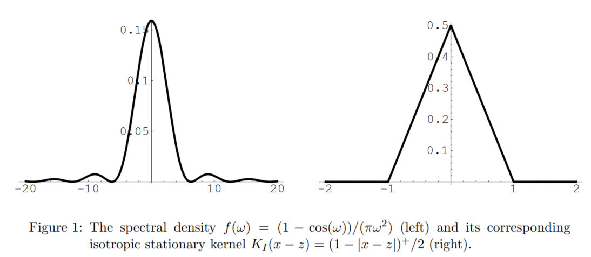
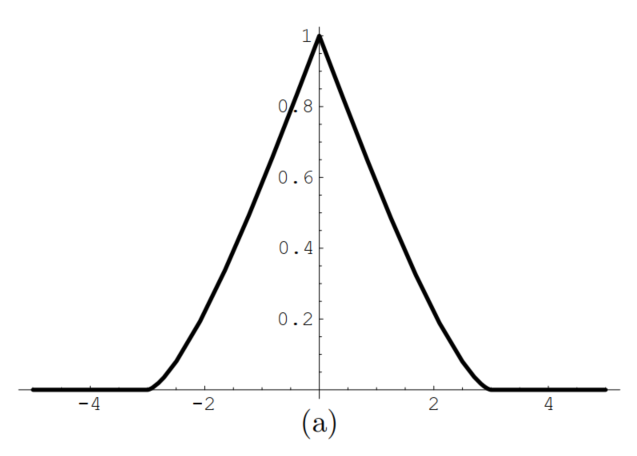
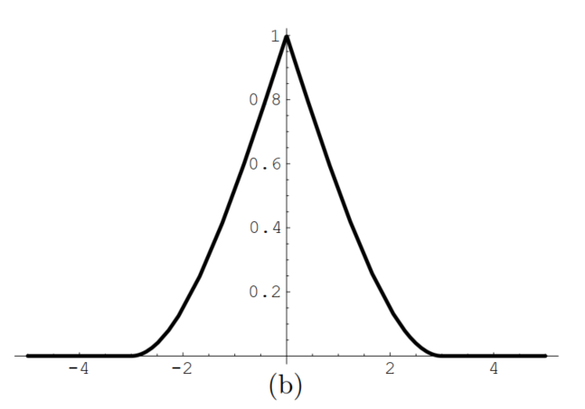
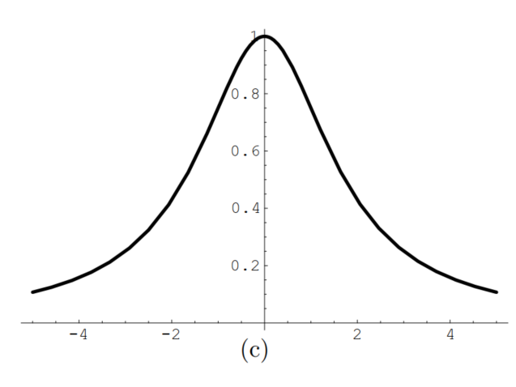
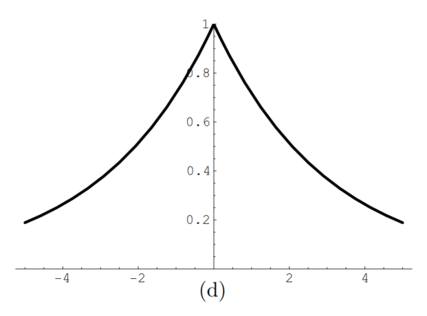
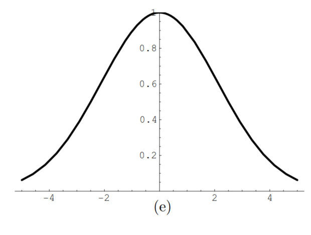
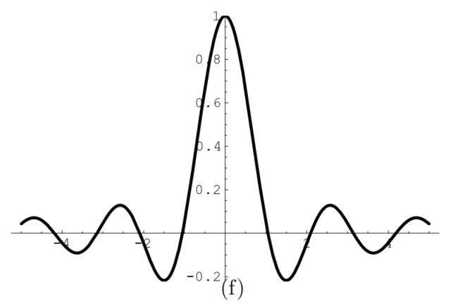
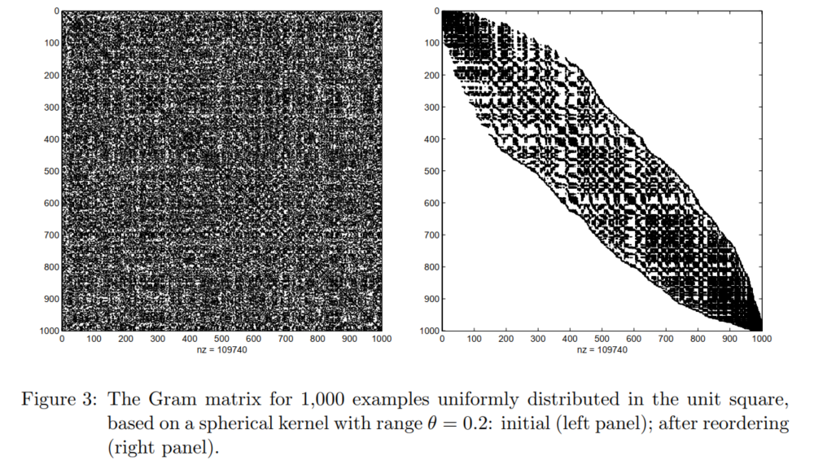

```{r "setup", include=FALSE, cache=F, message=F, warning=F, results="hide"}
knitr::opts_chunk$set(cache = TRUE, 
                      echo = FALSE,
                      message = FALSE, 
                      warning = FALSE)
knitr::opts_chunk$set(fig.height = 4, 
                      fig.width = 5, 
                      out.width = '80%',
                      fig.align='center')
```


# Introduction

## Introduction

Kernels allow to map the data into a high dimensional feature space in order to increase the computational power of linear machine.

Example algorithms

- Support vector machines
- Kernel principal component analysis
- Kernel Gram-Schmidt
- Bayes point machines
- Gaussian processes

## Kernel K

$\forall\ \pmb x,\ \pmb z \in \pmb X \subset \mathfrak R^d: \ K(\pmb x, \pmb z) = \langle \pmb\Phi(\pmb x),\ \pmb\Phi(\pmb z)\rangle$, where $\Phi$  is a nonlinear (or sometimes linear) map from the input space $\pmb X$ to the feature space $\mathfrak F$, and $\langle .,\ .\rangle$ is an inner product.

- Kernel must be symmetric: $K(\pmb x,\ \pmb z) = K(\pmb z,\ \pmb x)$

- Kernel also satisfies the Cauchy-Schwartz inequality: $K^2(\pmb x,\ \pmb z) \leq K(\pmb x,\ \pmb x)K(\pmb z,\ \pmb z)$.

- *Mercer (1909)*: a necessary and sufficient condition for a symmetric function $K(\pmb x,\ \pmb z)$ to be a kernel is that it be positive definite. $\forall\ x_1,\ ... ,\ x_l$ and real numbers $\lambda_1,\ ... ,\ \lambda_l$, the function $K$ must satisfy: 
$\sum_{i=1}^l \sum_{j=1}^l \lambda_i \lambda_j K(\pmb x_i, \pmb x_j) \leq 0 \ \ \ \ (1)$

*Symmetric positive definite functions are called covariances in statistics.*

## positive defintie functions Properties

1. If $K_1$, $K_2$ are two kernels, and $a_1$, $a_2$ are two positive real numbers, then:
$K(\pmb x,\ \pmb z) = a_1K_1(\pmb x,\ \pmb z) + a_2K_2(\pmb x,\ \pmb z)\ \ \ \ (2)$ is a kernel. 

2. The multiplication of two kernels $K_1$ and $K_2$ yields a kernel:
$K(\pmb x,\ \pmb z) = K_1(\pmb x,\ \pmb z)K_2(\pmb x,\ \pmb z)\ \ \ \  (3)$

3. Properties (2) and (3) imply that any polynomial with positive coefficients, $pol^+(x) = \{ \sum^n_{i=1} \alpha_i x^i|n \in \mathfrak N,\ \alpha_1,\ ... ,\ \alpha_n \in \mathfrak R^+ \}$, evaluatedat a kernel $K_1$, yields a kernel:
$K(\pmb x,\ \pmb z) = pol^+(K_1(\pmb x,\ \pmb z)) \ \ \ \ (4)$

##

4. In particular, we have that: $K(\pmb x,\ \pmb z) = \exp(K_1(\pmb x, \pmb z)) \ \ \ \ (5)$ is a kernel by taking the limit of the series expansion of the exponential function

5. If $g$ is a real-valued function on $\pmb X$, then $K(\pmb x,\ \pmb z) = g(\pmb x)g(\pmb z) \ \ \ \ (6)$ is a kernel. 

6. If $\psi$ is an $\mathfrak R_p$-valued function on $\pmb X$ and $K_3$ is a kernel on $\mathfrak R_p \times \mathfrak R_p$, then:
$K(\pmb x,\ \pmb z) = K_3(\psi(\pmb x), \psi(\pmb z))\ \ \ \ (7)$
is also a kernel

7. If $\pmb A$ is a positive definite matrix of size $d \times d$, then: $K(\pmb x,\ \pmb z) = \pmb x^{\top} \pmb A \pmb z \ \ \ \ (8)$ is a kernel

## Extra property to construct kernels

- Let $h$ be a real-valued function on $\pmb X$, positive, with minimum at $0$ (that is, $h$ is a variance function). Then:
$K(\pmb x,\ \pmb z) = \frac {h(\pmb x + \pmb z) - h(\pmb x - \pmb z)} 4 \ \ \ \ (9)$ is a kernel. 

- The justification of (9) comes from the following identity for two random variables $Y_1$ and $Y_2$: $Cov[Y_1,\ Y_2] = \frac {Var[Y_1 + Y_2] - Var[Y_1 - Y_2]} 4$. 

- For instance, $h(\pmb x) = \pmb x^{\top} \pmb x$. From (9), we obtain the kernel: $K(\pmb x,\ \pmb z) = \frac {(\pmb x + \pmb z)^{\top} (\pmb x + \pmb z) - (\pmb x - \pmb z)^{\top} (\pmb x - \pmb z)} 4 = \pmb x^{\top} \pmb z$.


# Stationary Kernels

- A stationary kernel is one which is translation invariant:
$K(\pmb x,\ \pmb z) = K_s (\pmb x - \pmb z)$, which only depends on the lag vector. 

- Also referred as ansiotropic stationary kernel, to emphasize the dependence on both direction and length of the lag vector.

- *Bochner (1955)*: $K_s (\pmb x - \pmb z)$ is positive definite in $\mathfrak R^d$ iff it has the form: $K_s (\pmb x - \pmb z) = \int _{\mathfrak R^d} \cos \big(\pmb \omega ^{\top} (\pmb x - \pmb z)\big) F(d\pmb \omega) \ \ \ \ (10)$, where $F$ is a positive finite measure. 

- The quantity $F / K_S(\pmb 0)$ is called the spectral distribution function. *The Fourier dual in GPML book*. Note that (10) is simply the Fourier transform of F.


## isotropic (or homogeneous) stationary kernel

- When a stationary kernel depends only on the norm of the lag vector between two examples, and not on the direction, then the kernel is said to be isotropic (or homogeneous), and is thus only a function of distance:
$K(\pmb x,\ \pmb z) = K_I(\|x - z\|)$.

- The spectral representation of isotropic stationary kernels has been derived from *Bochner's theorem (Bochner, 1955)* by Yaglom (1957): 

$$
K_I(\|x - z\|) = \int_0^\infty \Omega_d (\omega\|x - z\|)F(d\omega) \ \ \ \ (11)
$$ 

- where $\Omega_d(x) = \Big({\frac 2 x}\Big)^{(d-2)/2} \Gamma \Big({\frac d 2}\Big) J_{(d-2)/2}(x)$, form a basis for functions in $\mathfrak R^d$. Here $F$ is any nondecreasing bounded function, $\Gamma(d/2)$ is the gamma function, and $J_v$ is the Bessel function of the first kind of order $v$. 

## isotropic (or homogeneous) stationary kernel

- Some familiar examples of $\Omega_d$ are $\Omega_1(x) = \cos(x)$, $\Omega_2(x) = J_0(x)$, and $\Omega_3(x) = \sin(x)/x$.

- By choosing a nondecreasing bounded function $F$ (or its derivative $f$), we can derive the corresponding kernel from (11). For instance in $\mathfrak R^1$, with the spectral density $f(\omega) = (1 - \cos(\omega))/(\pi \omega_2)$, we derive the triangular kernel: 

$$
K_I(\pmb x - \pmb z) = \int_0^\infty \cos(\omega|x - z|) \frac {1 - \cos(\omega)} {\pi \omega^2} d\omega = {\frac 1 2} (1 - |x - z|)^+
$$

where $(x)^+ = max(x,\ 0)$ (see *Figure 1*). 


## 

```{r out.width="80%"}

```

##

- Note that an isotropic stationary kernel obtained with $\Omega_d$ is positive definite in $\mathfrak R^d$ and in lower dimensions, but not necessarily in higher dimensions. 

- For example, the kernel $K_I(\pmb x - \pmb z) = (1 - |x - z|)^+/2$ is positive definite in $\mathfrak R^1$ but not in $\mathfrak R^2$. 

- It is interesting to remark from (11) that an isotropic stationary kernel has a lower bound *(Stein, 1999)*: $K_I(\|\pmb x - \pmb z\|)/K_I(0) \geq \inf_{x \geq 0} \Omega_d(x)$, thus yielding:

  - $K_I(\|\pmb x - \pmb z\|)/K_I(0) \geq -1\ in\ \mathfrak R^1$        
  - $K_I(\|\pmb x - \pmb z\|)/K_I(0) \geq -0.403\ in\ \mathfrak R^2$    
  - $K_I(\|\pmb x - \pmb z\|)/K_I(0) \geq -0.218\ in\ \mathfrak R^3$     
  - $K_I(\|\pmb x - \pmb z\|)/K_I(0) \geq 0\ in\ \mathfrak R^\infty$    

##

- The isotropic stationary kernels must fall off more quickly as the dimension d increases, as might be expectedby examining the basis functions $\Omega_d$. Those in $R^\infty$ have the greatest
restrictions placedon them. 

- Isotropic stationary kernels that are positive definite in $\mathfrak R^d$ form a nested family of subspaces. When $d \rightarrow \infty$ the basis $\Omega_d(x)$ goes to $\exp(-x^2)$. 

- *Schoenberg (1938)*: if $\beta_d$ is the class of positive definite functions of the form given by *Bochner (1955)*, then the classes for all $d$ have the property: $\beta_1 \subset \beta_2 \subset \ ...\ \subset \beta_d \subset ...\ \subset \beta_\infty$, so that as $d$ is increased, the space of available functions is reduced. 


## Commonly used isotropic stationary kernels $K_I(\|\pmb x - \pmb z\|)/K_I(0)$ 

### (a) Circular: 

positive definite in $\mathfrak R^2$
${\frac 2 \pi} \arccos \Big(\frac {\|\pmb x - \pmb z\|} \theta \Big) - {\frac 2 \pi} \frac {\|\pmb x - \pmb z\|} \theta \sqrt {1 -  \Big(\frac {\|\pmb x - \pmb z\|} \theta \Big)^2}$ if $\|\pmb x - \pmb z\| < \theta$ zero otherwise

```{r "f2a", out.width="50%"}

```

##

### (b) Spherical: 

positive definite in $\mathfrak R^3$
$1 - {\frac 3 2} \frac {\|\pmb x - \pmb z\|} \theta + {\frac 1 2} \Big(\frac {\|\pmb x - \pmb z\|} \theta \Big)^3$ if $\|\pmb x - \pmb z\| < \theta$ zero otherwise

```{r "f2b", out.width="50%"}

```

##

### (c) Rational quadratic: 

positive definite in $\mathfrak R^d$
$1 - \frac {\|\pmb x - \pmb z\|^2} {\|\pmb x - \pmb z\|^2 + \theta}$

```{r "f2c", out.width="50%"}

```

##

### (d) Exponential: 

positive definite in $\mathfrak R^d$
$\exp \Big(- \frac {\|\pmb x - \pmb z\|} \theta \Big)$

```{r "f2d", out.width="50%"}

```

##

### (e) Gaussian: 

positive definite in $\mathfrak R^d$
$\exp \Big(- \frac {\|\pmb x - \pmb z\|^2} \theta \Big)$

```{r "f2e", out.width="50%"}

```

##

### (f) Wave: 

positive definite in $\mathfrak R^3$
$\frac {\theta} {\|\pmb x - \pmb z\|} \sin \Big(\frac {\|\pmb x - \pmb z\|} \theta \Big)$

```{r "f2f", out.width="50%"}

```

##

- $\theta > 0$ as a scale parameter:

- The exponential kernel (d) is obtained from the spectral representation (11) with the spectral density:
$f(\omega) = \frac 1 {{\frac \pi \theta} + \pi \theta\omega^2}$

- The Gaussian kernel (e) is obtained with the spectral density: $f(\omega) = \frac {\sqrt \theta} {2\sqrt \pi} \exp \Big(-\frac {\theta\omega^2} 4\Big)$.

- Note also that the circular and spherical kernels have compact support. They have a linear behavior at the origin, which is also true for the exponential kernel. 

- The rational quadratic, Gaussian, and wave kernels have a parabolic behavior at the origin. This indicates a different
degree of smoothness. 

## Matern kernel

- The Matern kernel *(Matern, 1960)* has recently received
considerable attention, because it allows to control the smoothness with a parameter $\nu$.

- The Matern kernel is defined by:

$$
K_I(\|\pmb x - \pmb z\|)/K_I(0) = {\frac 1 {2^{\nu-1}\Gamma(\nu)}} \Big(\frac {2\sqrt \nu\|\pmb x - \pmb z\|} {\theta} \Big)^\nu H_\nu \Big(\frac {2\sqrt \nu\|\pmb x - \pmb z\|} {\theta} \Big) \ \ \ \ (12)
$$

where $\Gamma$ is the Gamma function and $H_\nu$ is the modified Bessel function of the second kind of order $\nu$.

- Note that the Matern kernel reduces to the exponential kernel for $\nu = 0.5$ and to the Gaussian kernel for $\nu \rightarrow \infty$.


## Compactly supported kernels

- Compactly supported kernels are kernels that vanish whenever the distance between two examples $\pmb x$ and $\pmb z$ is larger than a certain cut-off distance, often called the range. 

- For instance, the spherical kernel (b) is a compactly supported kernel since $K_I(\|\pmb x - \pmb z\|) = 0$ when $\|\pmb x - \pmb z\| \geq \theta$. This might prove a crucial advantage for certain applications dealing with massive data sets, because the corresponding Gram matrix $G$, $G_{ij} = K(\pmb x_i,\ \pmb x_j)$, will be sparse. 

- Then, linear systems involving the matrix $G$ can be solved very efficiently using sparse linear algebra techniques, seen *Gilbert et al.(1992)*.

## Example

```{r "f3 Gram matrix", out.width="80%"}

```

## Example (continued)

- The reordered Gram matrix has now a bandwidth of only 252 instead of 1,000 for the initial matrix, andimportant computational savings can be obtained. 

- A compactly supported kernel of Matern type can be obtained by multiplying the kernel (12) by the kernel: $\max \Big\{ \big(1 - \frac {\|\pmb x - \pmb z\|} {\tilde \theta} \big)^{\tilde \nu},\ 0\Big\}$, where $\tilde \theta > 0$ and $\tilde \nu \geq (d + 1)/2$, in order to insure positive definiteness. 

- This product is a kernel by the property (3). Beware that it is not possible to simply "cut-off" a kernel in order to obtain a compactly supported one, because the result will not be positive definite in general.

# Locally Stationary Kernels

## Locally Stationary Kernels

*(Silverman, 1957, 1959)*: 
$$
K(\pmb x,\ \pmb z) = K_1 \Big(\frac {\pmb x + \pmb z} 2 \Big) K_2(\pmb x - \pmb z) \ \ \ \ (13)
$$ 

- where $K_1$ is a nonnegative function and $K_2$ is a stationary kernel. Note that if $K_1$ is a positive constant, then (13) reduces to a stationary kernel. 

- Further impose that $K_2(\pmb 0) = 1$. The variable $(\pmb x + \pmb z)/2$ has been chosen because of its suggestive meaning of the average or centroidof the examples $\pmb x$ and $\pmb z$. 

##

- The variance is determined by: $K(\pmb x,\ \pmb x) = K_1(\pmb x)K_2(\pmb 0) = K_1(\pmb x)\ \ \  (14)$
thus justifying the name of power schedule for $K_1(x)$, which describes the global structure.

- On the other hand, $K_2(\pmb x-\pmb z)$ is invariant under shifts and thus describes the local structure. It can be obtained by considering: $K(\pmb x/2,\ -\pmb x/2) = K_1(\pmb 0)K_2(\pmb x) \ \ \ \ (15)$ 

## Properties

- Equations (14) and (15) imply that the kernel $K(\pmb x,\ \pmb z)$ defined by (13) is completely determinedby its values on the diagonal $\pmb x = \pmb z$ and antidiagonal $\pmb x = - \pmb z$, for: 

$$
K(\pmb x,\ \pmb z) = \frac {K \big({\frac {(\pmb {x + z})} 2},\ {\frac {(\pmb {x + z})} 2}\big)K \big({\frac {(\pmb {x - z})} 2},\ -{\frac {(\pmb {x - z})} 2}\big)} {K(\pmb 0,\ \pmb 0)} \ \ \ \ (16)
$$

- $K_1$ is invariant with respect to shifts parallel to the antidiagonal, whereas $K_2$ is invariant with respect to shifts parallel to the diagonal. 

- These properties allow to find moment estimators of both $K_1$ and $K_2$ from a single realization of data, although the kernel is not stationary.

##

- Another special class of locally stationary kernels is defined by kernels of the form: $K(\pmb x,\ \pmb z) = K_1(x + z) \ \ \ \ (17)$ the so-called exponentially convex kernels *(Loeve, 1946, 1948)*. 

- From (16), we see immediately that $K_1(\pmb x + \pmb z) \geq 0$. Actually, as notedby Loeve, any two-sided Laplace transform of
a nonnegative function is an exponentially convex kernel.

## 

- A large class of locally stationary kernels can therefore be constructed by multiplying an exponentially convex kernel by a
stationary kernel, since the product of two kernels is a kernel by the property (3).

- However, the following example is a locally stationary kernel in $\mathfrak R^1$ which is not the product of two kernels:
$\exp[-a(x^2+z^2)]=\exp \Big[-2a\big(\frac {x+z} 2\big)^2\Big] \exp\Big[-\frac {a(x+z)^2} 2\Big],\ a>0 \ \ \ \ (18)$
since the first factor in the right side is a positive function without being a kernel, and the second factor is a kernel.

##

- Finally, with the positive definite Delta kernel $\delta(\pmb x - \pmb z)$, which is equal to 1 if $\pmb x = \pmb z$ and 0 otherwise, the product: $K(\pmb x,\ \pmb z) = K_1\Big(\frac {\pmb x + \pmb z} 2\Big) \delta(\pmb x - \pmb z)$, is a locally stationary kernel, often called a *locally stationary white noise*.

- The spectral representation of locally stationary kernels has remarkable properties. Indeed, it can be written as *(Silverman, 1957)*: $K(\pmb x,\ \pmb z) = \int_{\mathfrak R^d} \int_{\mathfrak R^d} \cos(\pmb \omega^{\top}_1 \pmb x - \pmb\omega ^{\top}_2 \pmb z) f_1\big(\frac {\pmb\omega_1+\pmb\omega_2} 2\big) f_2(\pmb\omega_1-\pmb\omega_2)d\pmb\omega_1d\pmb\omega_2$,

- i.e. the spectral density $f_1\big(\frac{\pmb\omega_1+\pmb\omega_2}{2}\big)f_2(\pmb\omega_1-\pmb\omega_2)$ is also a locally stationary kernel, and:

$$
K_1(\pmb u)=\int_{\mathfrak R^d}\cos(\pmb\omega^{\top}\pmb u)f_2(\pmb\omega)d\pmb\omega
$$
\vspace{5mm}
$$
K_2(\pmb v)=\int_{\mathfrak R^d}\cos(\pmb\omega^{\top}\pmb v)f_1(\pmb\omega)d\pmb\omega
$$

##

- i.e. $K_1$, $f_2$ and $K_2$, $f_1$ are Fourier transform pairs. For instance, to the locally stationary kernel (18) corresponds the spectral density: 

\tiny

$$
f_1\big(\frac{\omega_1 + \omega_2}{2}\big)f_2(\omega_1 - \omega_2)={\frac 1 {4\pi a}}\exp \Big[-\frac 1{2a}\big(\frac {(\omega_1 + \omega_2)} 2\big)^2\Big] \exp\Big[-\frac 1{8a} \frac {(\omega_1 - \omega_2)^2}2\Big]
$$

\normalsize

- This is immediately seen to be locally stationary since, except for a positive factor, it is of the form (18), with a replaced by $1/(4a)$. 

- In particular, we can obtain a very rich family of locally stationary kernels by multiplying a Matern kernel (12) by an exponentially convex kernel (17). The resulting product is still a kernel by the property (3).


# Nonstationary Kernels

## Nonstationary kernels

- The most general class of kernels is the one of nonstationary kernels, $K(\pmb x,\ \pmb z)$.

- For example, the polynomial kernel of degree $p$: $K(\pmb x,\ \pmb z) = (\pmb x^{\top}\pmb z)^p$, is a nonstationary kernel. The spectral representation of nonstationary kernels is very general. A nonstationary kernel $K(\pmb x,\ \pmb z)$ is positive definite in $\mathfrak R^d$ if and only if it has the form *(Yaglom, 1987)*: where $F$ is a positive bounded symmetric measure. 

$$
K(\pmb x,\ \pmb z) = \int_{\mathfrak R^d} \int_{\mathfrak R^d} \cos(\pmb\omega_1^{\top} \pmb x-\pmb\omega_2^{\top} \pmb z)F (d\pmb\omega_1, d\pmb\omega_2)\ \ \ \ (19)
$$


- When the function $F(\pmb \omega_1, \pmb\omega_2)$ is concentrated on the diagonal $\omega_1 = \omega_2$, then (19) reduces to the spectral representation (10) of stationary kernels. Here again, many nonstationary kernels can be constructed with (19).

##

- Of interest are nonstationary kernels obtainedfrom (19) with $\pmb \omega_1 = \pmb \omega_2$ but with a spectral density that is not integrable in a neighborhoodaroundthe origin. Such kernels are referred to as generalized kernels *(Matheron, 1973)*. 

- For instance, the Brownian motion generalized kernel corresponds to a spectral density $f(\omega) = 1/\|\omega\|^2$ *(Mandelbrot and Van Ness, 1968)*.

- A particular family of nonstationary kernels is the one of separable nonstationary kernels: $K(\pmb x,\ \pmb z) = K_1(\pmb x)K_2(\pmb z)$, where $K_1$ and $K_2$ are stationary kernels evaluated at the examples $\pmb x$ and $\pmb z$ respectively.

##

- Separable nonstationary kernels possess the property that their Gram matrix $G$, with $G_{ij}=K(\pmb x_i, \pmb x_j)$, can be written as a tensor product (also called Kronecker product, see *Graham, 1981*) of two vectors defined by $K_1$ and $K_2$ respectively. 

- This is especially useful to reduce computational burden when dealing with massive data sets. For instance, consider a set of $l$ examples $\pmb x_1,\ ... ,\ \pmb x_l$. The memory requirements for the computation of the Gram matrix is reduced from $l^2$ to $2l$ since it suffices to evaluate the vectors $\pmb a=\big(K_1(\pmb x_1),\ ...,\ K_1(\pmb x_l)\big)^{\top}$ and $\pmb b=\big(K_2(\pmb x_1),\ ...,\ K_2(\pmb x_l)\big)^{\top}$. 

- We then have $G = \pmb{ab}^{\top}$. Such a computational reduction can be of crucial importance for certain applications involving very large training sets.


# Reducible Kernels

## Main idea 

- To find a new feature space where stationarity (see *Sampson and Guttorp, 1992*) or local stationarity (see *Genton and Perrin, 2001*) can be achieved. 

- A nonstationary kernel $K(\pmb x,\ \pmb z)$ is stationary reducible if there exist a bi-jective deformation $\pmb \Phi$ such that: $K(\pmb x,\ \pmb z) = K_S^*(\pmb\Phi(\pmb x) - \pmb\Phi(\pmb z))\ \ \ \ (20)$ where $K_S^*$ is a stationary kernel. 

- For example in $\mathfrak R^2$, the nonstationary kernel defined by: $K(\pmb x,\ \pmb z) = \frac {\|\pmb x\| + \|\pmb z\| - \|\pmb z - \pmb x\|}{2 \sqrt{\|\pmb x\|\|\pmb z\|}} \ \ \ \ (21)$ is stationary reducible with the deformation: $\pmb \Phi(\pmb x_1, \pmb x_2) = \bigg(\ln\Big(\sqrt {x^2_1+x^2_2}\Big),\ \arctan(x_2/x_1)\bigg)^{\top}$, yielding the stationary kernel:

$$
K_S^*(\pmb u_1, \pmb u_2) = \cosh(\frac{\pmb u_1} 2) - \sqrt{\frac {\cosh(\frac {\pmb u1} 2) - \cos(\pmb u_2)} 2} \ \ \ \ (22)
$$

##

- Effectively, it is straightforward to check with some algebra that (22) evaluated at: $\pmb\Phi(\pmb x) - \pmb\Phi(\pmb z) = \bigg( \ln\Big(\frac {\|\pmb x\|}{\|\pmb z\|}\Big),\ \arctan \big(\frac {x_2} {x_1}\big) - \arctan\big(\frac {z_2} {z_1}\big) \bigg)^{\top}$, yields the kernel (21). 

- Specifically, if $\pmb \Phi$ and its inverse are differentiable in $\mathfrak R^d$, and $K(\pmb x,\ \pmb z)$ is continuously differentiable for $\pmb x \neq \pmb y$, then $K$ satisfies (20) if and only if: $D_{\pmb x}K(\pmb x,\ \pmb z)Q^{-1}_{\pmb \Phi}(\pmb x) + D_{\pmb z}K(\pmb x,\ \pmb z)Q^{-1}_{\pmb \Phi} (\pmb z) = \pmb 0,\ \pmb x \neq \pmb y \ \ \ \ (23)$, where $Q_{\pmb \Phi}$ is the Jacobian of $\pmb \Phi$ and $D_{\pmb x}$ denotes the partial derivatives operator with respect to $\pmb x$. 

##

- Unfortunately, not all nonstationary kernels can be reduced to stationarity through a deformation $\pmb \Phi$. Consider for instance the kernel in $\mathfrak R^1$: $K(\pmb x,\ \pmb z) = \exp(2-x^6-z^6) \ \ \ \ (24)$, which is positive definite as can be seen from (6). 

- It is obvious that $K(\pmb x,\ \pmb z)$ does not satisfy Equation (23) andthus is not stationary reducible. This is the motivation of *Genton and Perrin (2001)* to extend the model (20) to locally stationary kernels.

- We say that a nonstationary kernel $K$ is locally stationary reducible if there exists a bi-jective deformation $\pmb \Phi$ such that: $K(\pmb x,\ \pmb z) = K_1\Big(\frac {\pmb\Phi(\pmb x) + \pmb\Phi(\pmb z)} 2\Big) K_2 (\pmb\Phi(\pmb x) - \pmb\Phi(\pmb z)) \ \ \ \ (25)$, where $K_1$ is a nonnegative function and $K_2$ is a stationary kernel. 

##

- Note that if $K_1$ is a positive constant, then Equation (25) reduces to the model (20). *Genton and Perrin (2001)* characterize such transformations $\pmb \Phi$. 

- For instance, the nonstationary kernel (24) can be reduced to a locally stationary kernel with the transformation: $\pmb\Phi(x) = \frac {x^3} 3 - \frac 1 3 \ \ \ \ (26)$, yielding:
$K_1(u) = \exp(-18u^2 - 12u) \ \ \ \ (27)$ and $K_2(v) = \exp \big(-\frac 9 2 v^2\big)  \ \ \ \ (28)$


## 

- Here again, it can easily be checked from (27), (28), and (26) that: $K_1\Big(\frac {\pmb\Phi(x) + \pmb\Phi(z)} 2 \Big)K_2\big(\pmb\Phi(x)-\pmb\Phi(z)\big)=\exp(2-x^6-z^6)$.

- Of course, it is possible to construct nonstationary kernels that are neither stationary reducible nor locally stationary reducible.

- Actually, the familiar class of polynomial kernels
of degree $p$, $K(\pmb x,\ \pmb z) = (\pmb x^{\top}\pmb z)^p$, cannot be reduced to stationarity or local stationarity with a bi-jective transformation $\pmb \Phi$. 

# Conclusion

## Summary

- Kernels introduced in this paper
  - stationary (anisotropic/isotropic/compactly supported)
  - locally stationary
  - nonstationary 
  - separable nonstationary kernels

- Each class has its own particular properties and spectral representation (allows for the design of many new kernels in each
class).
  - Note that kernels from the classes presented in this paper can be combined indefinitely by using the properties (2)-(9). 
  - This should prove useful to researchers designing new kernels and algorithms for machine learning. 
  - In particular, the reducibility of nonstationary kernels to simpler kernels which are stationary or locally stationary suggests interesting applications.


