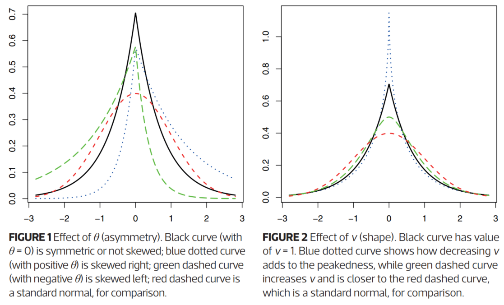

```{r "setup", include=FALSE, cache=F, message=F, warning=F, results="hide"}
knitr::opts_chunk$set(cache = TRUE, 
                      echo = FALSE,
                      message = FALSE, 
                      warning = FALSE)
knitr::opts_chunk$set(fig.height = 4, 
                      fig.width = 5, 
                      out.width = '70%',
                      fig.align='center')
```

# Scott Nestler & Andrew Hall (2019)

## What is the variance gamma distribution?

### The usual approach to investing 

#### Harry Markowitz's "mean–variance" portfolio optimisation

- To maximise return on investment 
- Also to constrain risk at the same time
- With risk viewed synonymously with variability and measured by variance
or standard deviation

- The *return* is defined as $r_t = \ln(s_t / s_{t–1})$, where $s_t$ represents the price of a stock at time $t$.
- Markowitz's model assumes that log returns of stocks and index funds are independent and identically distributed Gaussian random variables. 
- However, the data are actually skewed, with higher kurtosis than
would be expected: heavier tails and a more peaked center than a normal distribution.

### 

- A few such distributions meet early mentioned criteria
  - The normal inverse Gaussian 
  - The generalised hyperbolic, 
  - \alert {The variance gamma (VG)}


- The VG, also known as the generalised Laplace or Bessel function
distribution:

\tiny

$$
f_X(x| \mu,\ \sigma,\ \theta,\ \nu) = 
\frac {2\exp(\theta(x - \mu)/\sigma^2)} {\sigma\sqrt{2\pi} \nu^{1/\nu}\Gamma(1/\nu)} 
\Bigg( \frac {|x - \mu|} {\sqrt{2\theta^2/\nu + \sigma^2}} \Bigg)^{1/\nu - 1/2}K_{1/\nu - 1/2}\Bigg(\frac {|x-c|\sqrt{2\sigma^2/\nu+\theta^2}} {\sigma^2} \Bigg)
$$

$\Gamma(.)$ is the gamma function                   
$K_\eta(.)$ is a modified Bessel function of the third kind, of order $\eta$                   
$\mu \in (-\infty,\ \infty)$ is the location parameter                  
$\sigma \in [0,\ \infty)$ is the scale/spread parameter                
$\theta \in (-\infty, \infty)$ is the asymmetry parameter                     
$\nu \in [0, \infty)$ is the shape parameter                           

## What does it look like?

- A Unimodal, with a single peak, and heavy tails
- Decreases algebraically rather than decreasing exponentially
- The VG distribution is quite flexible

```{r}

```

### Moments

Cannot be completely described by the first two moments, mean and variance 
The shape parameter $\nu$ for kurtosis to the normal distribution with a kurtosis of 3
With an assumed small skewness ($\theta$)

The first four moments of the VG are:

1. mean: $E[X_t] = \mu + \theta$
2. variance: $Var[X_t] = \sigma^2$
3. skewness: $\gamma[X_t] = 3\theta\nu/\sigma$
4. kurtosis: $\kappa[X_t] = 3(1 + \nu)$

### Summary

Three common ways to simulate from the VG distribution are: 

1. As a time-changed Brownian motion with a gamma

2. The difference of two non-decreasing (Gamma) processes

3. Using a compound Poisson process, for an approximation

An R package, VarianceGamma (bit.ly/2NZZnJ2), includes the ability to estimate parameters 
from data and also simulate random variates. 


# Bessel function 


###

```{r fig.height=8, fig.width=8}
require(graphics)

nus <- c(0:5, 10, 20)

x <- seq(0, 4, length.out = 501)
plot(x, x,
     ylim = c(0, 6), 
     ylab = "", 
     type = "n",
     main = "Bessel Functions  I_nu(x)")
for (nu in nus) {
  lines(x, 
        besselI(x, nu = nu), 
        col = nu + 2)
}

legend(0, 6, 
       legend = paste("nu=", nus), 
       col = nus + 2, 
       lwd = 1)
```

###

```{r fig.height=8, fig.width=8}
x <- seq(0, 40, length.out = 801)
yl <- c(-.8, .8)
plot(x, x,
  ylim = yl, 
  ylab = "", 
  type = "n",
  main = "Bessel Functions  J_nu(x)")

for (nu in nus) lines(x, besselJ(x, nu = nu), col = nu + 2)
legend(32, -.18, legend = paste("nu=", nus), col = nus + 2, lwd = 1)
```


###

```{r fig.height=8, fig.width=8}
## Negative nu's :
xx <- 2:7
nu <- seq(-10, 9, length.out = 2001)
op <- par(lab = c(16, 5, 7))
matplot(nu, 
        t(outer(xx, nu, besselI)),
        type = "l", 
        ylim = c(-50, 200),
        ylab = "",
        main = expression(paste("Bessel ", 
                                I[nu](x), 
                                " for fixed ", 
                                x,  ",  as ", f(nu))),
        
        xlab = expression(nu))
abline(v = 0, 
       col = "light gray",
       lty = 3)
legend(5, 200, 
       legend = paste("x=", xx), 
       col = seq(xx), 
       lty = seq(xx))
par(op)
```

###

```{r fig.height=8, fig.width=8}
x0 <- 2^(-20:10)
plot(x0, x0^-8,
     log = "xy",
     ylab = "", 
     type = "n",
     main = "Bessel Functions  J_nu(x)  near 0 (log - log  scale)")

for (nu in sort(c(nus, nus + 0.5))) {
  lines(x0, besselJ(x0, nu = nu), col = nu + 2)
}

legend(3, 1e50,
  legend = paste("nu=", paste(nus, nus + 0.5, sep = ",")),
  col = nus + 2, 
  lwd = 1)
```

###

```{r fig.height=8, fig.width=8}
plot(x0, x0^-8,
     log = "xy", 
     ylab = "", 
     type = "n",
     main = "Bessel Functions  K_nu(x)  near 0 (log - log  scale)")

for (nu in sort(c(nus, nus + 0.5))) {
  lines(x0, besselK(x0, nu = nu), col = nu + 2)
}

legend(3, 1e50,
       legend = paste("nu=", paste(nus, nus + 0.5, sep = ",")),
       col = nus + 2,
       lwd = 1)
```

###

```{r fig.height=8, fig.width=8}
x <- x[x > 0]
plot(x, x,
     ylim = c(1e-18, 1e11), 
     log = "y",
     ylab = "", 
     type = "n",
  main = "Bessel Functions  K_nu(x)"
)
for (nu in nus) lines(x, besselK(x, nu = nu), col = nu + 2)
legend(0, 1e-5, legend = paste("nu=", nus), col = nus + 2, lwd = 1)
```

###

```{r fig.height=8, fig.width=8}
yl <- c(-1.6, .6)
plot(x, x,
     ylim = yl, 
     ylab = "", 
     type = "n",
     main = "Bessel Functions  Y_nu(x)")

for (nu in nus) {
  xx <- x[x > .6 * nu]
  lines(xx, besselY(xx, nu = nu), col = nu + 2)
}

legend(25, -.5,
       legend = paste("nu=", nus), 
       col = nus + 2,
       lwd = 1)
```

###

```{r fig.height=8, fig.width=8}
## negative nu in bessel_Y -- was bogus for a long time
curve(besselY(x, -0.1), 0, 10, 
      ylim = c(-3, 1), 
      ylab = "")
for (nu in c(seq(-0.2, -2, by = -0.1))) {
  curve(besselY(x, nu), add = TRUE)
}
title(expression(BesselY(x, nu) * "   " * {
  nu == list(-0.1, -0.2, ..., -2)
}))

```


