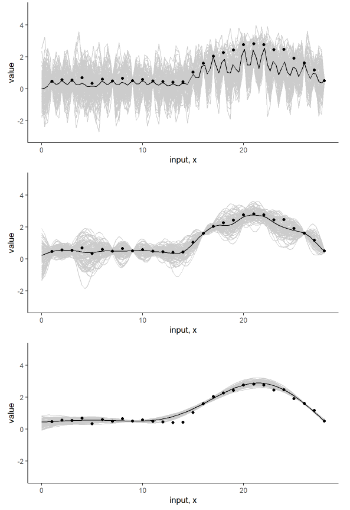
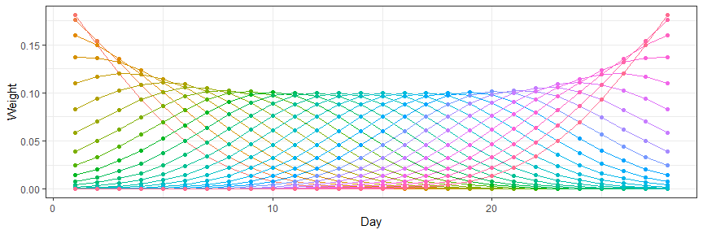

```{r setup, include=FALSE}
knitr::opts_chunk$set(echo = TRUE)
```

# Don't Panic!




$i = 1, ..., n$ for individual subject trajectory;\
$j = 1, ..., p_i$ for observations within each individual subject;\
$t_{i_j} \in \mathcal T$;

$$
\begin{split}
& Y_{i}(t_{i_j}) = f_i(t_{i_j}) + \epsilon_{i_j}\\
& Y_{i}(\pmb t_{i}) = f_i(\pmb t_{i}) + \pmb \epsilon_{i}\\
& \epsilon_{i_j} \sim \mathcal {N}(0, \sigma_\epsilon^2)\\
& f_i(.) \sim\mathcal {GP} (\mu(.),\ \Sigma(., .))\\
\end{split}
$$




$$
\begin{split}
& E[Y_i] = f_i(.)\\
& E[f_i] = \mu(.)\\
&\Sigma[t_i, s_i] = E\Big[\big(f_i(s_i) - \mu(s_i)\big)\big(f_i(t_i) - \mu(t_i)\big)\Big]
\end{split}
$$

$$
\begin{split}
& Y_i(t_i)|f_i(t_i), \ \sigma_\epsilon \sim \mathcal {MVN} (f_i(t_i),\ \sigma_\epsilon^2 I)\\
& f_i(t_i)|\mu(t_i), \ \Sigma(t_i, t_i') \sim \mathcal {MVN} \big(\mu(t_i), \ \Sigma(t_i, t_i')\big)\\
& \log p(Y_i|f_i) \propto -\frac {1}{2 \sigma_\epsilon^2} (Y_i - f_i)^{\top} (Y_i - f_i) - \frac n 2 \log \sigma_\epsilon^2\\
& \log p(f_i| \mu, \ \Sigma) \propto -\frac {1}{2} (f_i - \mu)^{\top} \Sigma^{-1} (f_i - \mu) - \frac 1 2 \log(det (\Sigma)) \\
\end{split}
$$

$$
\begin{split}
& k(t_{i_a},\ t_{i_b})\\
& k(t_{i_0},\ .)\\
& K(t_i, \ t_i')\\
\end{\split}
$$


I want to use the kernel density estimator

$$
\begin{split}
& \hat g_p(t_0) = \frac 1 p \sum^p_{j=1} \frac 1 h k \Bigg(\frac {T_{j} − t_{0}} {h} \Bigg)\\
& \log L(g) =  
\int k \Bigg(\frac {T_{j} − t_{0}} {h} \Bigg) (\log g()) =
\sum_{j=1}^p \log g(T_{j}) − p \int \Bigg(g(u)du - 1\Bigg)\\
& \log L_{t_{0}} (g) = \sum_{j=1}^p k \Bigg(\frac {T_{j} − t_{0}} {h} \Bigg)
\log g(T_{0}) − p \int k\Bigg(\frac {u − t_{0}}{h} \Bigg)g(u)du\\
\end{split}
$$

Then use Taylor's

$$
g(t) = g(t_0) + g'(t - t_0) + \frac {g''(t - t_0)^2}{ 2!} + ... + \frac {g^{(d)}(t - t_0)^d}{d!}
$$

replace all the $\mu^{(d)}$ with $\beta_d$

## Frequentist

to estimate each observation

$$
\begin{split}
& \sum_{j=1}^p\Bigg[ Y_{i_j} - \sum_{k=0}^d \beta_{i_k}(T_{i_j} - t_{i_0})^k \Bigg] w(t_{i_j})\\
& w(t_{i_0}) = \frac {k\big(\frac {T_{i_j} - x_{i_0}} {h}\big)}{\sum^p_{j=1} k\big(\frac {T_{i_j} - t_{i_0}} {h} \big)}\\
\end{split}
$$

## Bayesian

setting priors for $\sigma_\epsilon$, $\mu$, and $\Sigma$

" The choice of kernel K is not too important. Estimates obtained by using different kernels are usually numerically very similar." from Section 6.2.3 of Scott (1992). This observation should have been confirmed by theoretical calculations which show that the risk is very insensitive to the choice of kernel; What does matter much more is the choice of bandwidth $h$ which controls the amount of smoothing. -- Wasserman
